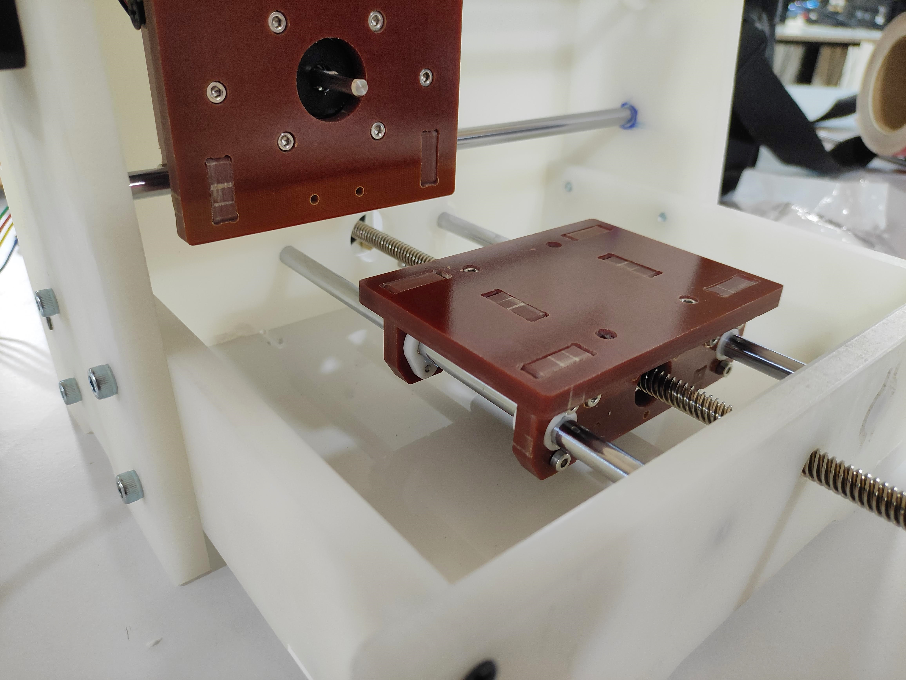

# Neo Micro

Neo Micro is an exercise in rigidity. The size of the original Neo was mostly determined by the size of the lead screw stepper motors and my assumption that a 1/64" end mill can't generate enough force to bend an 8mm rod supported 30cm apart. Well turns out that's not the case. 

I realized that the Z-axis alone might not be the problem. The small deflections of the X and Y axis contribute to improper cutting depth and the Z axis flexing about was rotating around the Y-axis.

The Neo Micro is a small format PCB milling optimized machine that has cool features like rotating hand wheels to jog the X and Y axis which is so very close to a Hass!

<iframe src="https://gmail1728488.autodesk360.com/shares/public/SH35dfcQT936092f0e4313c59e8c5fd25aac?mode=embed" width="640" height="480" allowfullscreen="true" webkitallowfullscreen="true" mozallowfullscreen="true"  frameborder="0"></iframe>

[Neo Micor V45](Images/micro/Neo Micro v45.zip)

### Machine Specs

**Bed Size:** 70x100mm  
**Z travel:** +-3.5mm  
**Spindle:** Modella spindle with BLDC motor

<video width="520" autoplay muted loop>
  <source src="../Images/micro/micro.mp4" type="video/mp4">
Your browser does not support the video tag.
</video>

### Improving Rigidity

A few steps I took was to first **reduce the length of the 8mm smooth rods**, from 300mm to 250mm and 200mm in the Y and X axis respectively. This in turn makes the machine smaller.

It was either this or make them bigger like a 12mm dia rod, but 8mm is more common and considering the normal sizes of PCBs we make in the lab its a worth while trade off.

The second is to use **Phenolic laminates which have higher rigidity than HDPE** or PP. Working with Phenolics are harder than other plastics as there is little give for dimensional error. The tolerances are an order of magnitude tighter than plastics.

But phenolics bring a level of rigidity better than delrin and are economical. They are difficult to machine and work with but the effort pays off in the end.

For the last machine I was using Delrin as both the structural and bearing member but considering the cost of Delrin, its wise to use it only as a bearing material. The solution is to use phenolics to machine the structure and **insert delrin bearings**.

### Design

The design is similar to previous iterations, sliding bearings and lead screw stepper motor. Some small changes are in the material used and way everything is aligned.

The major change is the axis are made out of Phenolic laminate and the Delrin bushings are used as insert. This allows us an opportunity to change the bushings as needed and we are not using a lot of precious delrin to make them.

All gantry members have braces that support and align them to each other. The braces are loose fit into the holes and held tight with M3 nuts and bolts. This became a necessity as Phenolic press-fit tolerances are in order of 10-20 Microns and the material thickness is not consistent.

X and Y axis layout similar to the previous machines, Y axis rods are 250mm and X axis is 200mm. This allows for efficient use of the 1m rods that come as standard lengths.

The frame resembles the previous builds and there are a few elements added to increase the rigidity like the Acrylic plate below the bed which pulls all the sides to square and prevents deflection from side to side.

The back plate is now a single piece and all the 3 frame elements connect to it providing a strong back bone to the machine. This also doubles as the mounting point for all the electronics hardware.

### Fabrication

All the parts were made out of 10mm Polypropylene, 6.8mm Phenolic, 10.4mm Delrin, 3mm Acrylic

The parts of the frame lined on a 80 x 40cm PP sheet. The left one is for 3mm acrylic.

When machining phenolics take care about proper dust evacuation.

The X axis supports with both the braces installed.

The bearing machined out of delrin. Machine with small depth and slow feed for the internal bearing surface as the ZUND underlay is not good at holding tight tolerances. Need to switch to MDF.

The completed X-axis with bearings installed and braces held firmly with screws. This unit is compact and very rigid.

The X-axis installed into the frame. The motor is inserted into the back and the threaded rod and bushings are added.

The back acrylic plate which will hold down all the sides and prevent flexing. This is 3mm acrylic. Switching to 6mm will give better result next time.

The X and Y axis assembled and ready to test.

I'm using the same spindle and flexure from the previous build to test how much of an improvement we can get by increasing the rigidity of the frame.

**PTFE grease** is applied as an initial lubrication for the delrin bushings and the lead screw nuts, this will help with the run-in period and help increase the life of the bearings.

### Testing

<video width="520" autoplay muted loop>
  <source src="../Images/micro/c1.mp4" type="video/mp4">
Your browser does not support the video tag.
</video>

The initial tests have been promising and the improvement in the bed rigidity helped with maintaining the correct height. The X and Y axis have less than 0.1mm backlash and Z axis is rigid enough for milling.

<video width="520" autoplay muted loop>
  <source src="../Images/micro/c3.mp4" type="video/mp4">
Your browser does not support the video tag.
</video>

We can cut at a feed rate of **4mm/sec and depth of 0.1mm**

Tested with both **1/64" and 1/32" end mills** there is very little deflection in the Z-axis.

### Machine BOM

| Sl no | Item                          | Description                | Qty      |
| ----- | ----------------------------- | -------------------------- | -------- |
| 1     | TinyG                         | Motor Controller           | 1        |
| 2     | 10mm PP Sheet                 | Machine body               | 80x40cm  |
| 3     | 8mm Smooth rods               | Linear guides              | 1m       |
| 4     | 1/4" Phenolic laminate        | Motion stages              | 1 Sqft   |
| 5     | 10mm Delrin                   | Sliding bearings           | 0.5 Sqft |
| 6     | Nema 17 Integrated lead screw | 30Cm lead screw motor      | 2        |
| 7     | Lead screw Nut                | X and Y stages             | 2        |
| 8     | Nema 17 D shaft Stepper motor | Z axis                     | 1        |
| 9     | M3x10 SHCS                    | Fasteners                  | ~20      |
| 10    | M5x16 SHCS                    | Fasteners                  | ~10      |
| 11    | M4x16 Plastic screws          | Coarse thread machine body | ~40      |
| 12    | M3, M5 washers                | Spacing and fastening      | ~20      |
| 13    | 15V 150W power supply         | Can be turned upto 18V     | 1        |
| 14    | 2216 Bruhless motor           | Spindle motor              | 1        |
| 15    | ESC 20A                       | 18V ESC for spindle        | 1        |
| 16    | 6702 bearing                  | 15x21x4 bearing CAM        | 1        |
